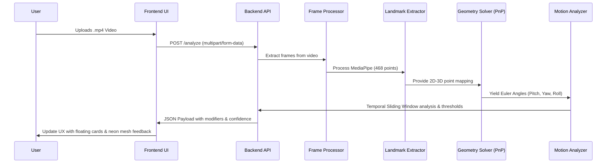

# VividHead: The ISL Interpreter

VividHead is a full-stack AI system that converts Indian Sign Language (ISL) non-manual head movements into text-level grammatical modifiers.

## Project Philosophy
### The "Anti-Gravity" Design System
VividHead abandons traditional blocky UI in favor of an immersive "Anti-Gravity" glassmorphism experience. Using fluid animations, transparent cards, Gaussian blur orbs, and dynamic neon mesh overlays (via Framer Motion), the UI creates a weightless, futuristic environment that feels responsive and alive.

### Semantic Bridge Logic
The application acts as a "Semantic Bridge" between raw kinematic data and linguistic meaning. By continuously assessing Euler angles (Pitch, Yaw, Roll) via a PnP geometry solver, it maps dynamic motion thresholds directly to grammatical modifiers (e.g., Affirmative, Negative, Question/Uncertainty). It bridges computer vision metrics with ISL conversational norms without requiring explicit hand gestures.

## Architecture Flow



## Folder Structure Map
```text
vividhead/
├── backend/
│   ├── app.py                 # FastAPI application and endpoints
│   ├── evaluate_dataset.py    # Metric evaluation against datasets
│   ├── head_logic.py          # Core PnP Euler angle calculations & thresholds
│   ├── hybrid_model.py        # ML hybrid model logic (optional)
│   ├── requirements.txt       # Python dependencies
│   ├── train_hybrid.py        # Script to train hybrid classifier
│   └── Dockerfile             # Container configuration for Hugging Face Spaces
├── frontend/
│   ├── app/                   # Next.js 14 App Router layout & pages
│   ├── components/            # Reusable UI components (VividLogo, UI cards)
│   ├── logic/                 # Frontend state and API interaction
│   ├── public/                # Static assets
│   ├── next-env.d.ts          # TypeScript environment declaration
│   ├── next.config.mjs        # Next.js configuration
│   ├── package.json           # Node.js dependencies
│   ├── postcss.config.mjs     # PostCSS styling config
│   └── tailwind.config.ts     # Tailwind CSS configuration framework
├── dataset/                   # Local categorized ISL phrase datasets
├── README.md                  # Global documentation
└── .gitignore                 # Git ignore patterns
```

## Quick Start

### 1) Backend setup
```bash
cd backend
python -m venv venv
# Windows
venv\Scripts\activate
# macOS/Linux
# source venv/bin/activate
pip install --upgrade pip
pip install -r requirements.txt
uvicorn app:app --reload --host 0.0.0.0 --port 7860
```

### 2) Frontend setup
```bash
cd frontend
npm install --legacy-peer-deps
cp .env.example .env.local
npm run dev
```

Open `http://localhost:3000` and upload an `.mp4` to test the full pipeline.

## Deployment Targets
- Backend Space: <https://huggingface.co/spaces/01mayankk/computervision-backend>
- Frontend Platform: Vercel (Edge Runtime where possible)
